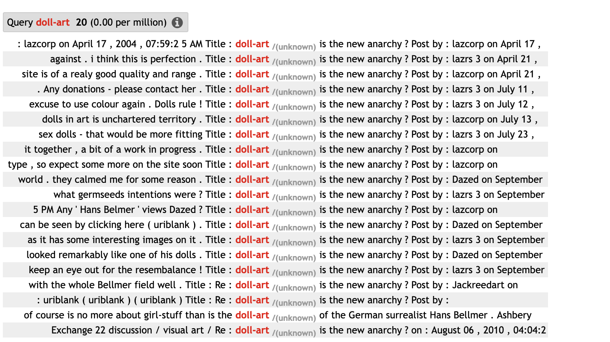

# Covarying-collexeme analysis

Last but not least, let's take a look at covarying-collexeme analysis. As the name already reveals, this method is about "covarying collexemes". Many constructions have more than one open slot - think of the [*the* ADJ-*est* N *ever*] construction that we've just encountered, or the "snowclone" [X *BE the new* Y]. In such cases, it can be interesting to take a look at the constructions that occur *together* in the same construction.


```{r ccatable1, echo=FALSE, warning = FALSE, message = FALSE}

d_scc <- readxl::read_xlsx("/Users/stefanhartmann/sciebo/Tutorials/collostructions_tutorial/data/overview_tables/covarying_collexeme_analysis_overview.xlsx", sheet = 1)
colnames(d_scc)[1] <- ""

knitr::kable(
  d_scc, booktabs = TRUE,
  caption = 'Frequency information needed for distinctive collexeme analysis'
)

```

Again, it helps to illustrate this with a concrete example, in this case the [X *BE the new* Y] construction with instances like *Scientists are the new rock stars*:

```{r ccatable2, echo=FALSE, warning = FALSE, message = FALSE}

d_scc <- readxl::read_xlsx("/Users/stefanhartmann/sciebo/Tutorials/collostructions_tutorial/data/overview_tables/covarying_collexeme_analysis_overview.xlsx", sheet = 2)
colnames(d_scc)[1] <- ""

knitr::kable(
  d_scc, booktabs = TRUE,
  caption = 'Example contingency table for distinctive collexeme analysis'
)

```


As it happens, Tobias Ungerer and I have investigated this construction as well, so we can use our dataset, which is again drawn from ENCOW16A:

```{r}

xnewy <- read_csv("data/x_is_the_new_y/ENCOW_x_is_the_new_y_without_false_hits.csv")

```

All we need in this case are the `Lemma_x` and `Lemma_y` columns in the table, which we can easily pass to `collex.covar` from the `collostructions` package - like `collex.dist`, it accepts both frequency tables and word lists with one observation per line as input. So we just have to select the relevant columns and pass the resulting dataframe to the `collex.covar` function. First, however, we convert the columns Lemma_x and Lemma_y to lowercase, because the use of capitalization is a bit inconsistent in those columns.^[In fact, it is a bit more complex because we actually used capitalization for marking heads of phrases, and to get more meaningful results, we would have to extract those heads first. We won't do this here to keep things simple, but you can read more [here](https://hartmast.github.io/Attack_of_the_snowclones/scripts/XisthenewY.html#Data_wrangling) if you're interested.]

```{r}

# convert to lowercase
xnewy$Lemma_x <- tolower(xnewy$Lemma_x)
xnewy$Lemma_y <- tolower(xnewy$Lemma_y)

# collexeme analysis
xnewy %>% select(Lemma_x, Lemma_y) %>% collex.covar(raw = T) %>% DT::datatable()

```

Unsurprisingly, the terms that tend to occur together come from similar domains, as in *small is the new big*, *x is the new y*, *transparency is the new objectivity*. *Doll-art is the new anarchy* is a bit surprising, but that might be an artifact of the corpus, which sometimes contains the same text(s) multiple times, which can distort the results. A quick look at the corpus data confirms this assumption:

```{r, echo = FALSE, out.width='75%', fig.align="center", fig.cap="Concordance for \"doll art\" in ENCOW"}



```

This is a reminder that the results of collostructional analysis are of course just as good as the database that you are using, and that aspects like corpus composition and potential biases in the data have to be taken into account. Apart from that, however, the results are again quite instructive, as they show which terms tend to go together (e.g. color terms with other color terms; abstract concepts with abstract concepts, etc.) and which don't.

Summing up, then, collostructional analysis can yield very revealing results that help us understand the semantics of linguistic constructions, as well as the restrictions they may be subject to.